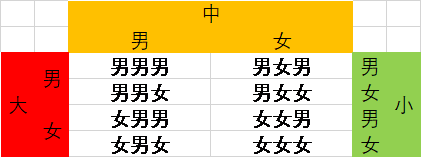

# 概率论的基本概念
## 基本概念
### 随机现象
在一定条件下：
* 试验有多钟可能的结果
* 事先不能确定哪一种结果会发生  

> Note：随机现象与一定的条件密切相连

### 试验
对随机事件加以的观察和研究称为试验  
### 随机试验
具有以下特点的试验：
* 可以在相同条件下重复进行
* 每次试验的可能结果不止一个
* 进行一次试验前，不能确定这一次试验会出现哪一个结果

随机试验通常记为E

### 样本空间
在一次试验中，无论可能出现的结果有多少，总可以从中找出一组基本结果，满足：
* 没进行一次试验，必然出现且只能出现其中的一个基本结果
* 任何结果，都由其中的一些结果所组成

随机试验E的所有基本记过组成的结果集合称为样本空间，记作Ω  
样本空间的元素，即E的每个基本结果称为样本点
## 一个感到困难的为题
### 已知一个家庭有3个小孩，且其中一个为女孩，求至少有一个男孩的概率（小孩为男女的概率是等可能的）.
#### 求解
如果不考虑该家庭有1个女孩的已知条件，对于一个有三个孩子的家庭，由于子女间存在年龄大小关系，所以，一个有三个孩子家庭中的性别组成会有8钟可能：  
  
>Tips:也可以将这种兄弟姐妹的关系看作三个有顺序的位置，每个位置有两种情况，所以就有八种情况了。  

由于题目中提到该家庭的三个孩子中以一个女孩，所以排除该家庭孩子全为男孩的情况，故此家庭的孩子的性别组成由7中可能。  

又由于题目要求该家庭至少有一个男孩子，所以只需要排除全为女孩子的可能，剩下的可能就符合题意了  

设“该家庭3个孩子中至少有一个男孩”为事件A，则$\overline{A}$为事件“该家庭3个小孩中没有男孩”；  

所以P(A) = 1-P($\overline{A}$) = 1 - 1/7 = 6/7

